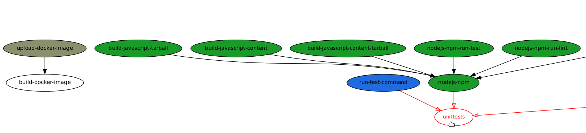

# ZuulGraph

Zuul graph generator of dependencies between buildjobs.

Usage: `xdot <(zuulgraph <zuul-jobs1.yaml> <zuul-jobs2.yaml>..)`

Here's an example ran on [zuul-jobs]( https://opendev.org/zuul/zuul-jobs.git):

